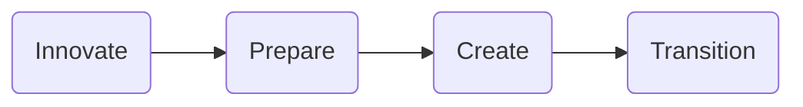

  

## Bottom Line Up Front

### This is a Solution Blueprint

This "Flight Path" is a _living document_ that showcases an adoption journey and blueprint for a successful _Proof of Technology_ implementation showcasing the capabilities of  **IBM FileNet Content Manager** on **Amazon Elastic Kubernetes Service (EKS)**. This repository and its contents is the result of a real customer engagement.

All of this journey, along with all code, architecture and assets is published and maintained in this repository. Click above to go to the GitHub repo.

## Value Engineering Method

The Value Engineering Method is a human and design-led approach to solve complex business problems with transformative technology. This approach uses a proven co-creation methodology that aligns our experts, utilize leadership based on thousands of projects, with key client stakeholders to quickly identify business or technology challenges and build Proof of Experiences (PoXs) that solve and ‘de-risk’ those problems using IBM technology.

### Working In The Open

The Flight Path approach embodies IBM Client Engineering's dedication to transparency and collaboration, which is evident through the creation of this accessible repository that showcases real-life customer experiences. By sharing this knowledge, IBM aims to develop user-friendly and scalable landing zones for customers that encourage the adoption of IBM Technology while prioritizing innovation and user experience. This repository represents IBM Client Engineering's commitment to _working in the open_, where stakeholders and interested parties can participate, provide feedback and benefit from collective knowledge.

Feel free to peruse other documented journeys [On our GitHub Open Solutions Library](https://github.com/ibm-client-engineering)

:::info

**IBM Client Engineering** is a **no-cost** investment in IBM's customers to co-create and innovate leveraging IBM technology and methodologies. We _partner_ with you to help you solve your most complex business challenges. [Engage us today!](https://www.ibm.com/client-engineering)

:::

