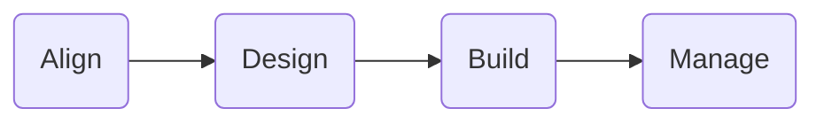

## Bottom Line Up Front

#### Flight Path

This is a living document for an adoption journey that synthesizes the best practices from IBM when considering and implementing  **IBM FileNet Content Manager on Amazon Elastic Kubernetes Service (EKS)**.

The Flight Path approach has its foundation in IBM Client Engineering's commitment to transparency and openness, exemplified by the maintenance of an accessible solution library founded on real-life customer experiences as captured in this repository. This approach aims to document user-friendly and adaptable landing zones to guide and promote adoption of IBM Technology with an emphasis on innovation, scalability, user experience.

:::info

IBM Client Engineering is a **no-cost** investment in IBM's customers to co-create and innovate leveraging IBM technology and methodologies. We partner with you to help you solve your business challenges. [Engage us today!](https://www.ibm.com/client-engineering)

:::
